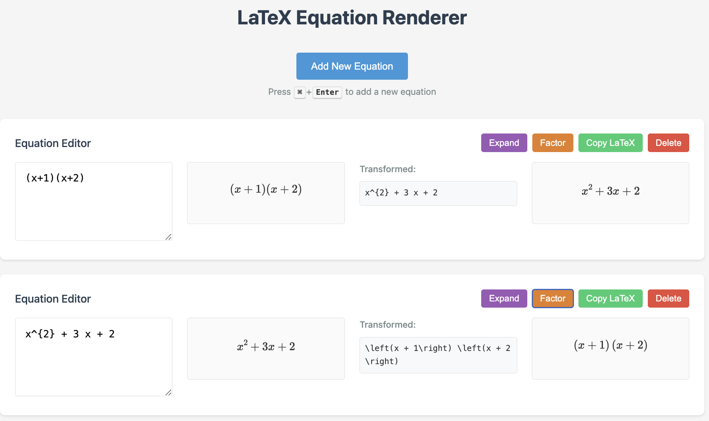

# LaTeX Equation Renderer

A real-time LaTeX equation editor and renderer with expansion and factoring capabilities. This web application allows users to write LaTeX equations and see them rendered instantly, with additional features for manipulating mathematical expressions.

## Features

- 🔄 Real-time LaTeX rendering using MathJax
- ➕ Multiple equation editors support
- ⌨️ Keyboard shortcuts (⌘+Enter or Ctrl+Enter to add new equations)
- 🧮 Mathematical operations:
  - Expand expressions
  - Factor expressions
- 📋 Copy LaTeX to clipboard
- 🎨 Clean, responsive interface
- ⚙️ Configurable settings



## Usage

## Http Server Prerequisite

The back-end http endpoints are not included in this project. Please implement an http server that provide endpoints like

```bash
curl -X POST http://localhost:5000/expand \
     -H "Content-Type: application/json" \
     -d '{"expression": "\\left(x + 1\\right) \\left(x + 2\\right)"}'
```

which returns 

```json
{
  "result": "x^{2} + 3 x + 2"
}
```

, and 

```bash
curl -X POST http://localhost:5000/factor \
     -H "Content-Type: application/json" \
     -d '{"expression": "x^2+3*x+2"}'
```

which returns 

```json
{
  "result": "\\left(x + 1\\right) \\left(x + 2\\right)"
}
```


### Basic Operations

1. **Adding Equations**:
   - Click the "Add New Equation" button
   - Use keyboard shortcut ⌘+Enter (Mac) or Ctrl+Enter (Windows/Linux)

2. **Writing Equations**:
   - Enter LaTeX code in the text area
   - See real-time rendering in the output area

3. **Manipulating Equations**:
   - Click "Expand" to expand mathematical expressions
   - Click "Factor" to factor expressions
   - Click "Copy LaTeX" to copy the equation to clipboard
   - Click "Delete" to remove an equation editor

### Example LaTeX Equations

```latex
# Simple polynomial
(x+1)(x+2)

# Quadratic formula
\frac{-b \pm \sqrt{b^2-4ac}}{2a}

# Integral
\int_{0}^{\infty} e^{-x^2} dx = \frac{\sqrt{\pi}}{2}
```

## Configuration

The application can be configured through `config.js`:

```javascript
const CONFIG = {
    API: {
        BASE_URL: 'http://localhost:5000',
        ENDPOINTS: {
            EXPAND: '/expand',
            FACTOR: '/factor'
        }
    },
    UI: {
        DEBOUNCE_TIME: 300,
        COPY_FEEDBACK_DURATION: 2000
    }
};
```

## Troubleshooting

1. **Server Connection Issues**:
   - Ensure the Flask server is running
   - Check if the port (default: 5000) is available
   - Verify the API base URL in `config.js`

2. **Rendering Problems**:
   - Check browser console for MathJax errors
   - Verify LaTeX syntax
   - Clear browser cache if needed

3. **CORS Issues**:
   - Check CORS settings in `.env`
   - Verify the server's CORS configuration

## Contributing

1. Fork the repository
2. Create a feature branch
3. Commit your changes
4. Push to the branch
5. Create a Pull Request

## License

This project is licensed under the MIT License - see the LICENSE file for details.

## Acknowledgments

- [MathJax](https://www.mathjax.org/) for LaTeX rendering
- [Flask](https://flask.palletsprojects.com/) for the backend server
- [SymPy](https://www.sympy.org/) for mathematical operations 